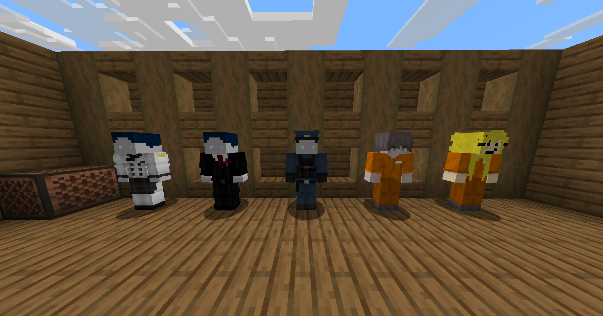

# Player Villagers - CraftAttack Edition

A resource pack for the German CraftAttack server that transforms villagers into custom player-like NPCs.



---

## 📦 What Does This Pack Do?

This resource pack transforms Minecraft villagers into **player-like NPCs** with custom textures based on their names. Perfect for roleplay elements on the CraftAttack server!

- **Named Villagers** → Custom player model with individual texture
- **Unnamed Villagers** → Remain normal vanilla villagers (unchanged)

---

## ✅ Requirements

- **OptiFine** OR **[Entity Model Features (EMF)](https://modrinth.com/mod/entity-model-features)** + **[Entity Texture Features (ETF)](https://modrinth.com/mod/entitytexturefeatures)** Mods
- Minecraft 1.14+ (1.21.10 tested)

---

## 🎮 Usage

### 1. Name a Villager
1. Get a name tag
2. Rename it at an anvil to one of the following names:
   - **Basti** - Player model with Basti texture
   - **Wache** - Guard model
   - **Koch** - Chef model
   - **HäftlingHugo** - Prisoner Hugo model
   - **Häftling1** - Prisoner model
3. Right-click on a villager with the name tag
4. The villager will now have the corresponding player model!

### 2. Reload Resources
Press **F3 + T** in-game to reload resources after applying name tags.

---

## 📋 Available NPCs

| Name | Description | Texture |
|------|-------------|--------|
| **Basti** | Custom NPC | `bastighg.png` |
| **Wache** | Guard/Soldier | `guard.png` |
| **Koch** | Kitchen Staff | `chef.png` |
| **HäftlingHugo** | Prisoner Hugo | `haeftlinghugo.png` |
| **Häftling1** | Prisoner | `haeftling1.png` |

---

## 🛠️ Technical Details

The pack uses **OptiFine's Custom Entity Models (CEM)** or **Entity Model Features (EMF)** to replace villager models based on name tags.

### File Structure
```
assets/minecraft/
├── optifine/cem/
│   ├── villager.properties      # Model selection rules
│   ├── villager2.jem           # Player-like model
│   ├── villager3.jem           # Additional models...
│   └── ...
└── textures/entity/villager/custom/
    ├── bastighg.png            # Custom textures
    ├── guard.png
    ├── chef.png
    └── ...
```

---

## 📝 Credits

Created for the German CraftAttack server.

---

## 📄 License

- Pack configs, models, and code are licensed under **GNU General Public License v3.0**.
- The skin PNG files in `assets/minecraft/textures/entity/villager/custom/*.png` are **third-party assets** that are not owned by me and are **not covered by the GPL**. They remain the property of their respective owners. If you are a rights holder and want attribution changes or removal, please contact me.

---
---

# 🇩🇪 Deutsche Version / German Version

---

# Player Villagers - CraftAttack Edition

Ein Resource Pack für den deutschen CraftAttack Server, das Dorfbewohnern benutzerdefinierte Spielermodelle verleiht.


---

## 📦 Was macht dieses Pack?

Dieses Resource Pack verwandelt Minecraft-Dorfbewohner in **spieler-ähnliche NPCs** mit benutzerdefinierten Texturen, basierend auf ihrem Namen. Perfekt für Rollenspielelemente auf dem CraftAttack Server!

- **Benannte Dorfbewohner** → Benutzerdefiniertes Spielermodell mit individueller Textur
- **Unbenannte Dorfbewohner** → Bleiben normale Vanilla-Dorfbewohner (unverändert)

---

## ✅ Voraussetzungen

- **OptiFine** ODER **[Entity Model Features (EMF)](https://modrinth.com/mod/entity-model-features)** + **[Entity Texture Features (ETF)](https://modrinth.com/mod/entitytexturefeatures)** Mods
- Minecraft 1.14+ (1.21.10 getestet)

---

## 🎮 Verwendung

### 1. Dorfbewohner benennen
1. Besorge dir ein Namensschild
2. Benenne es am Amboss in einen der folgenden Namen um:
   - **Basti** - Spielermodell mit Basti-Textur
   - **Wache** - Wächter-Modell
   - **Koch** - Koch-Modell
   - **HäftlingHugo** - Häftling Hugo Modell
   - **Häftling1** - Häftling Modell
3. Rechtsklick auf einen Dorfbewohner mit dem Namensschild
4. Der Dorfbewohner erhält nun das entsprechende Spielermodell!

### 2. Ressourcen neu laden
Drücke **F3 + T** im Spiel, um die Ressourcen nach dem Anbringen von Namensschildern neu zu laden.

---

## 📋 Verfügbare NPCs

| Name | Beschreibung | Textur |
|------|-------------|--------|
| **Basti** | Benutzerdefinierter NPC | `bastighg.png` |
| **Wache** | Wächter/Soldat | `guard.png` |
| **Koch** | Küchenpersonal | `chef.png` |
| **HäftlingHugo** | Häftling Hugo | `haeftlinghugo.png` |
| **Häftling1** | Häftling | `haeftling1.png` |

---

## 🛠️ Technische Details

Das Pack nutzt **OptiFine's Custom Entity Models (CEM)** bzw. **Entity Model Features (EMF)**, um Dorfbewohnermodelle basierend auf Namensschildern zu ersetzen.

### Dateistruktur
```
assets/minecraft/
├── optifine/cem/
│   ├── villager.properties      # Modell-Auswahlregeln
│   ├── villager2.jem           # Spieler-ähnliches Modell
│   ├── villager3.jem           # Weitere Modelle...
│   └── ...
└── textures/entity/villager/custom/
    ├── bastighg.png            # Benutzerdefinierte Texturen
    ├── guard.png
    ├── chef.png
    └── ...
```

---

## 📝 Credits

Erstellt für den deutschen CraftAttack Server.

---

## 📄 Lizenz

- Pack-Konfigurationen, Modelle und Code stehen unter der **GNU General Public License v3.0**.
- Die Skin-PNG-Dateien in `assets/minecraft/textures/entity/villager/custom/*.png` sind **fremde/bei Dritten liegende Assets**, die nicht von mir stammen und **nicht unter der GPL** stehen. Sie bleiben Eigentum der jeweiligen Urheber. Wenn Sie Rechteinhaber sind und eine Änderung der Nennung oder eine Entfernung wünschen, kontaktieren Sie mich bitte.